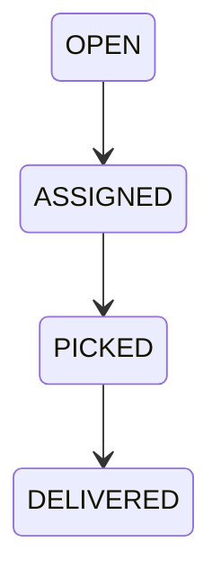
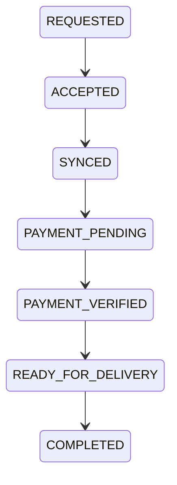
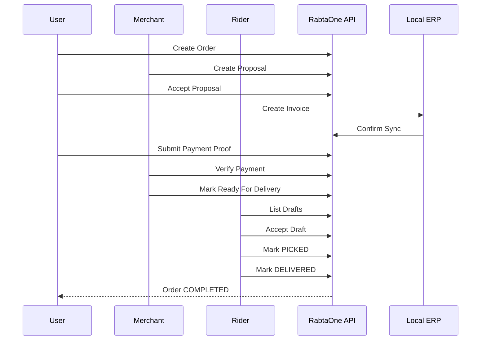
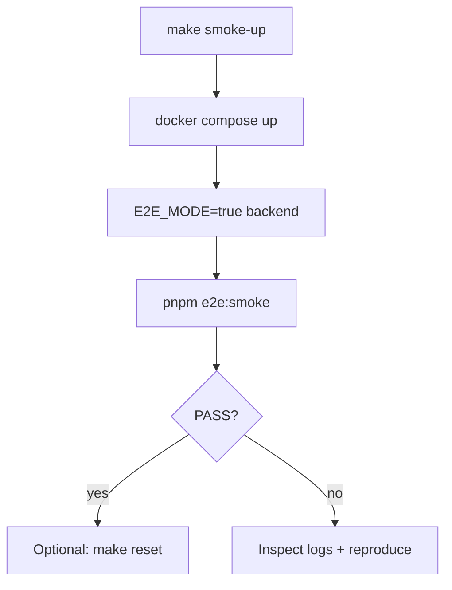

# Product Architecture

## Delivery Draft Lifecycle

```mermaid
stateDiagram-v2
    OPEN --> ASSIGNED
    ASSIGNED --> PICKED
    PICKED --> DELIVERED
```

## Order + Payment Lifecycle

```mermaid
stateDiagram-v2
  REQUESTED --> ACCEPTED
  ACCEPTED --> SYNCED
  SYNCED --> PAYMENT_PENDING
  PAYMENT_PENDING --> PAYMENT_VERIFIED
  PAYMENT_VERIFIED --> READY_FOR_DELIVERY
  READY_FOR_DELIVERY --> COMPLETED
```

## Smoke Test Flow

```mermaid
sequenceDiagram
  participant U as User
  participant M as Merchant
  participant R as Rider
  participant API as RabtaOne API
  participant ERP as Local ERP

  U->>API: Create Order
  M->>API: Create Proposal
  U->>API: Accept Proposal
  M->>ERP: Create Invoice
  ERP->>API: Confirm Sync
  U->>API: Submit Payment Proof
  M->>API: Verify Payment
  M->>API: Mark Ready For Delivery
  R->>API: List Drafts
  R->>API: Accept Draft
  R->>API: Mark PICKED
  R->>API: Mark DELIVERED
  API-->>U: Order COMPLETED
```

## E2E Tooling

```mermaid
flowchart TD
  A[make smoke-up] --> B[docker compose up]
  B --> C[E2E_MODE=true backend]
  C --> D[pnpm e2e:smoke]
  D --> E{PASS?}
  E -- yes --> F[Optional: make reset]
  E -- no --> G[Inspect logs + reproduce]
```
