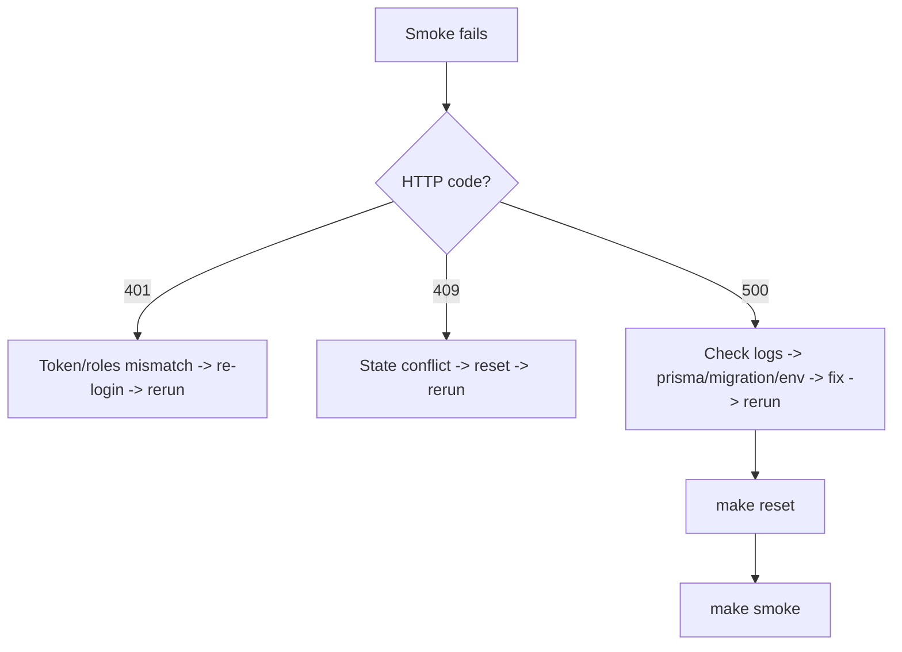

# Ops Troubleshooting

## Common Smoke Failures

### 401 Unauthorized
- Token missing or incorrect role
- Fix: re-run login or reset E2E users, then re-run smoke

### 409 Conflict
- Expected if state already advanced (e.g., proposal already accepted)
- Fix: run `make reset` and re-run smoke

### 500 Internal Server Error
- Likely migration/env mismatch or Prisma client issue
- Fix: check logs, ensure migrations applied, verify DATABASE_URL and Prisma client generation

## Safe Reset + Rerun

```bash
make reset
make smoke
```

## Inspect Logs

```bash
docker compose -f docker/docker-compose.yml logs -f backend
```

## Verify API Version

```bash
curl http://localhost:7101/api/v1/meta
```

## Check Migrations

Local:
```bash
pnpm --filter ideaapp-backend prisma:migrate
```

Docker:
```bash
docker compose -f docker/docker-compose.yml exec backend pnpm prisma migrate deploy
```

## Troubleshooting Flow


