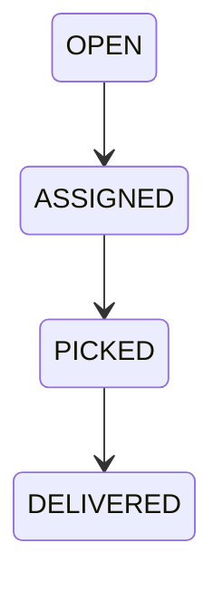
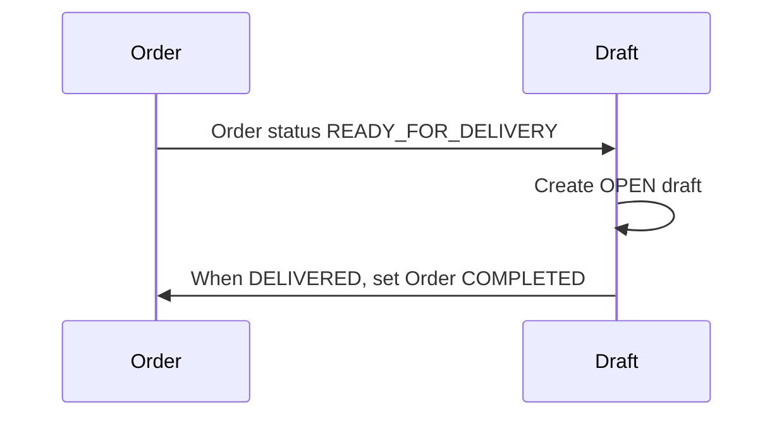

# v0.4.0 Release Notes

Release date: February 28, 2026

## Summary
v0.4.0 adds the Delivery Draft foundation for rider workflows. When orders reach `READY_FOR_DELIVERY`, a draft is created, riders can accept it, and progress it through `PICKED` and `DELIVERED`. Delivery completion marks the order as `COMPLETED`.

## Features
- DeliveryDraft model and lifecycle states
- Rider draft endpoints (list open, list assigned, accept, update status)
- Rider mobile UI for open drafts and job updates
- Order → delivery lifecycle link

## Known Limitations
- No live tracking, maps, or real-time location
- No rider bidding or commission logic
- No background workers; draft creation is synchronous

## Diagrams

Delivery draft lifecycle:

Order to delivery link:

