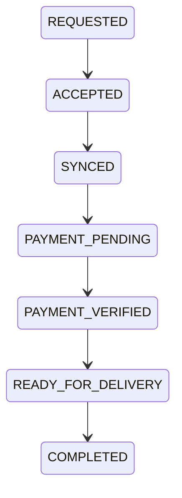
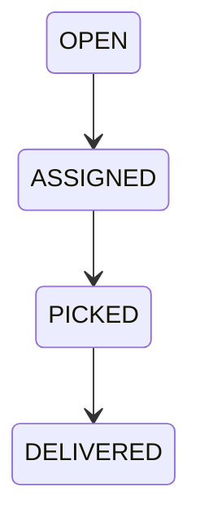

# v0.5.0 Release Notes

Release date: February 28, 2026

## Summary
v0.5.0 hardens the order lifecycle with atomic proposal acceptance, explicit payment steps, and idempotent delivery completion. It also introduces a read-only Admin console for operational monitoring.

## Features
- Atomic proposal acceptance with conflict handling
- Payment steps: PAYMENT_PENDING → PAYMENT_VERIFIED
- Delivery draft creation gated by payment verification
- Idempotent delivery completion
- Admin read-only monitoring dashboard
- Meta endpoint with version/build metadata

## Known Limitations
- No payments gateway integration
- No live tracking, maps, or notifications expansion
- No admin mutations (read-only only)

## Key Routes
- POST `/api/v1/orders/:id/accept-proposal`
- POST `/api/v1/orders/:id/payment/submit`
- POST `/api/v1/orders/:id/payment/verify`
- GET `/api/v1/admin/overview`
- GET `/api/v1/admin/orders`
- GET `/api/v1/admin/sync`
- GET `/api/v1/admin/delivery-drafts`
- GET `/api/v1/meta`

## Diagrams

Order + payment lifecycle:

Rider draft lifecycle:

